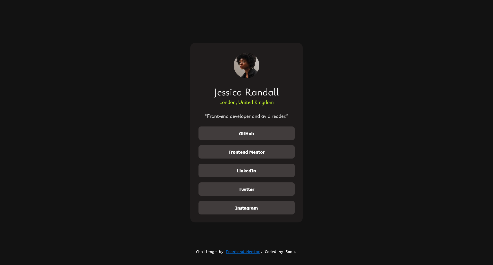

# Frontend Mentor - Social links profile solution

This is a solution to the [Social links profile challenge on Frontend Mentor](https://www.frontendmentor.io/challenges/social-links-profile-UG32l9m6dQ). Frontend Mentor challenges help you improve your coding skills by building realistic projects. 

### The challenge

Users should be able to:

- See hover and focus states for all interactive elements on the page

### Screenshot

### Links

- Solution URL: [Solution URL](https://github.com/itsfingerlickinggood/1)
- Live Site URL: [Live site URL](https://itsfingerlickinggood.github.io/1/)

## My process

### Built with

- HTML
- CSS 

### What I learned

Learned about buttons and links 

### Useful resources

- ChatGPT

## Author

- Frontend Mentor - (sonu)

