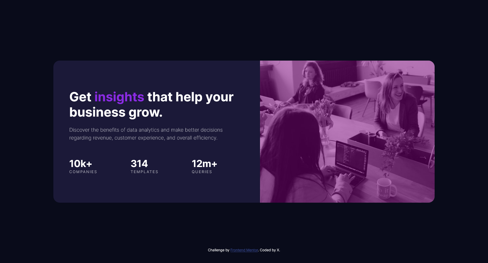

# Frontend Mentor - Recipe page solution

This is a solution to the [Recipe page challenge on Frontend Mentor](https://www.frontendmentor.io/challenges/recipe-page-KiTsR8QQKm). Frontend Mentor challenges help you improve your coding skills by building realistic projects. 

## Overview

### Screenshot

### Links

- Solution URL: [Add solution URL here](https://your-solution-url.com)
- Live Site URL: [Add live site URL here](https://your-live-site-url.com)

## My process

### Built with

- HTML5 
- CSS 
### What I learned

CSS flexbox and HTML tables

**Note: Delete this note and the content within this section and replace with your own learnings.**

### Continued development

CSS properties

### Useful resources
  The only resource i needed
- [ChatGPT](chat.openai.com) 

## Author

- Website - [Sonu]

